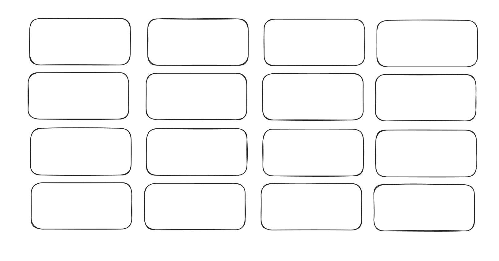

# Memorise

Initial Sketch of the UI

Idea is that we have good startup animations to flip each tile and get a matches

Tasks TODO

- [x] Create a basic UI of boxes in JS
- [x] Add a flip animation to the boxes, with images behind them
- [x] Add concept of matches to do with game state

- [x] Add a match animation, reward